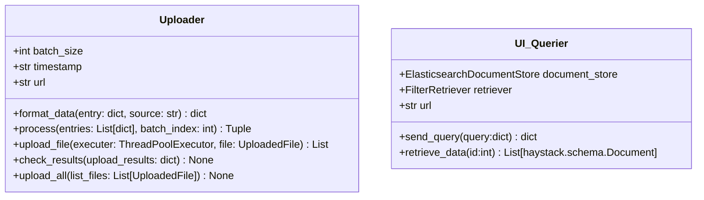

# mirror-ui

### Context
The mirror ui service is a user interative interface. This interface has been tested on the [MS Marco dataset](https://public.ukp.informatik.tu-darmstadt.de/thakur/BEIR/datasets/). It is able to upload Jsonl files and query the data that has been uploaded. The upload Jsonl file has the following fiels {"_id", "title", "text", "metadata"}

### Project Organization
------------

    |
    ├── build                   <- Folder that contains files for building the environment 
    │   ├── docker-compose.yml  <- docker-compose file for quickly building containers
    │   ├── Dockfile            <- Dockerfile for building docker image
    │   └── requirements.txt    <- The requirements file for reproducing the analysis environment, e.g.
    |
    ├── src                     <- Source code for use in this project.
    |   ├── app.py              <- Source code for streamlist interface
    |   ├── query.py            <- Source code to use haystack to query the elastic service
    │   └── upload.py           <- Source code to use multi-threading to upload batches of entries
    |
    └── README.md               <- The top-level README for developers using this project.
------------

### Pre-condition
It requires the gateway and elastic services to start running and it requires a config.yaml file which is not included in this repository. Below is a sample config.yaml file

``` yaml
# YAML
elasticsearch:
    host:
    port:
    username:
    password:
    index:

gateway:
    host:
    port:
    
ui_service:
    batch_size:
```

### Expected functionalities
The service is able to 
- Upload multiple files
- Each file is send in batches of 1000
- Feedback the status of each json batch if any batch fails
- Query and display search results

### Classes
Each service is enable by the two classes as shown below. 



### Sequence diagram
This is a sample sequence of events to understand the function of the ui service.
(To be added)
